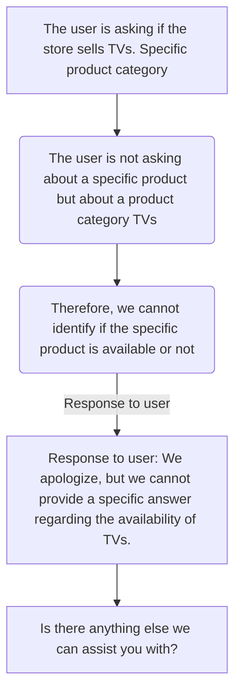

The self-explanatory part of processing replies and delivering outputs. 

Here is a sample internal dialogue of the model for ease :

--- 
For our convenience, we find it easier to mask the thoughts and reply to a simple dialogue for our answer. 

The codes are marked with comments as well to understand. 
